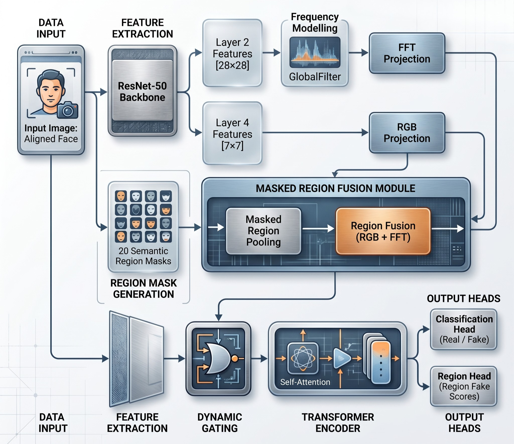

# Advanced Deepfake Detection: Hybrid Vision Transformer with Frequency and Region-Guided Enhancements

**Student:** Hooriya Masood (20613137)  
**Supervisor:** Dr. Tissa Chandesa  
**School of Computer Science, University of Nottingham Malaysia**  
**Submission:** 30th April 2026

---

## 1. Overview

This repository contains the source code for the FYP dissertation *Advanced Deepfake Detection: Hybrid Vision Transformer with Frequency and Region-Guided Enhancements*. The submission mirrors the development progression described in the dissertation: three exploratory stages (Stages 1–3) followed by a final architecture incorporating a learnable GlobalFilter module and 20 anatomically structured semantic region tokens.

All notebooks include saved outputs from the original training runs, so reviewers can verify reported metrics without re-executing any code.

---

## 2. Folder Structure

| Folder | Report Section | Contents |
|---|---|---|
| `1_Stage1_Model/` | Section 5.2 | Baseline RGB + FFT concatenation |
| `2_Stage2_Model/` | Section 5.3 | Cross-modal fusion + SLIC tokenisation |
| `3_Stage3_Model/` | Section 5.4 | Dual-token transformer (pretrain + finetune) |
| `4_Final_Model/` | Sections 5.7–5.9 | **Final architecture** with GlobalFilter and semantic region tokens (pretrain + finetune) |
| `5_Alternative_Localisation_Approaches/` | Section 5.8.1–5.8.4 | Four exploratory localisation methods. **Discarded in favour of trainable semantic region localisation in the final model.** Included for completeness. |
| `6_Validation_and_Ablation/` | Sections 5.5.1–5.5.2 | Label shuffle sanity check and FFT ablation |
| `7_Supporting/` | Sections 4.3, 5.8.7 | Face alignment (preprocessing) and semantic mask generation |

**The principal contribution is in `4_Final_Model/`.** The other folders document the experimental progression that led to it.

---
## Checkpoints Provided

Saved model checkpoints (`.pth`) for the main experiments are already included in the repository structure and tracked using **Git LFS**.

To download them correctly, clone the repository with Git LFS enabled:

```bash
git lfs install
git clone [Advanced-Deepfake-Detection-with-Hybrid-Vision-Transformer]
git lfs pull

## Architecture Overview



The complete architecture combines a ResNet-50 backbone, a learnable GlobalFilter 
on Layer 2 feature maps (28×28), 20 anatomically structured semantic region tokens 
derived from MediaPipe Face Mesh, and a 4-layer transformer encoder. Detailed 
formulation in Chapter 3 of the dissertation
## 3. Datasets

This project uses three datasets. **Datasets are not included in this submission** due to size and licensing.

### 3.1 — 140K Real and Fake Faces (Pretraining)
- **Source:** Karnewar and Wang (2020), available publicly on Kaggle  
- **Link:** https://www.kaggle.com/datasets/xhlulu/140k-real-and-fake-faces  
- **Access:** Open — anyone can download from Kaggle.

### 3.2 — FaceForensics++ c23 (Fine-tuning)
- **Source:** Rössler et al. (2019)  
- **Access:** **Restricted.** Requires formal request and signed form submitted to the dataset's host institution. Approval typically takes several weeks.  
- **Request form:** https://github.com/ondyari/FaceForensics  
- **Note:** This dataset cannot be redistributed. Reviewers wishing to re-execute the FaceForensics++ notebooks must obtain access independently.

### 3.3 — FaceForensics++ c40 (Cross-dataset evaluation)
- Same source and access requirements as 3.2.  
- The c40 variant is the high-compression version of the same videos.

---

## 4. Environment

- **Python:** 3.10  
- **Framework:** PyTorch [your version, e.g. 2.1] with torchvision  
- **Hardware used during development:** Kaggle cloud notebooks with NVIDIA T4 GPU (mixed precision FP16 enabled)  
- **Memory:** ~16 GB GPU RAM required for batch size 16

### Key Dependencies
```
torch>=2.0
torchvision>=0.15
opencv-python
numpy
pandas
matplotlib
mtcnn                 # face detection
mediapipe             # facial landmarks for semantic masks
scikit-image          # SLIC superpixels (Stage 2 only)
scikit-learn          # evaluation metrics
einops                # tensor operations in transformer
```

A `requirements.txt` is included.

---
## 5. How to Run

### 5.1 — Get the Code

Clone or download the repository:

```bash

git clone [Advanced-Deepfake-Detection-with-Hybrid-Vision-Transformer]
```

Or download the submitted .zip and extract.

---

### 5.2 — Get the Datasets

Two of the three datasets require setup before notebooks can run.

**140K Real and Fake Faces (Pretraining)** — Public on Kaggle, no setup needed beyond mounting.  
Link: https://www.kaggle.com/datasets/xhlulu/140k-real-and-fake-faces

**FaceForensics++ c23 and c40 (Fine-tuning + Cross-dataset)** — Restricted access, requires setup:

1. Submit the access request form at https://github.com/ondyari/FaceForensics. Approval typically takes several weeks.
2. Once approved, download the c23 and c40 video files using the provided download script.
3. Extract frames from the videos using ffmpeg (10 frames per video, uniformly sampled — see Section 4.3.1 of the dissertation). Reference command:
   \`\`\`bash
   ffmpeg -i input.mp4 -vf "select='not(mod(n,N))',setpts=N/FRAME_RATE/TB" -vsync 0 frame_%04d.jpg
   \`\`\`
4. Upload the extracted frames to Kaggle as a **private dataset** (Datasets → New Dataset → Upload). This is the only way to use FF++ in Kaggle notebooks since the raw videos cannot be redistributed.

---

### 5.3 — Running on Kaggle (Recommended)

1. Go to Kaggle → Code → New Notebook → **File → Import Notebook** and upload the `.ipynb` file from this submission.  
2. In the right sidebar, click **+ Add Data** and add the relevant datasets:
   - For Stage 1, 2, 3 pretrain notebooks and Final Model pretrain: add the **140K Real and Fake Faces** public dataset.
   - For Stage 3 finetune, Final Model finetune, and Alternative Localisation notebooks: add your **private FF++ c23/c40 dataset** (uploaded in step 5.2).
3. Enable GPU: **Settings → Accelerator → GPU T4 x2** (or any GPU).
4. Update dataset paths at the top of the notebook (clearly marked `# DATA_PATH`) to match how Kaggle mounts the dataset (typically `/kaggle/input/[dataset-name]/`).
5. Click **Run All**, or step through cells.

**Note:** Notebooks already contain saved outputs from the original training runs. Reviewers can verify reported metrics by inspection without re-execution.

---

### 5.4 — Running Locally (IDE / Jupyter)

1. Install dependencies: `pip install -r requirements.txt`
2. Download the 140K dataset from Kaggle and place it locally.
3. Obtain FF++ access (see Section 5.2), download videos, and extract frames locally using ffmpeg.
4. Update the `DATA_PATH` variable at the top of each notebook to point to your local dataset folders.
5. Open in Jupyter or VS Code and run.

### 5.5 — Using Provided Checkpoints Instead of Retraining

Most notebooks support direct evaluation using the provided saved checkpoints, so reviewers do not need to rerun full training unless they want to.

- **Stage 1 and Stage 2 notebooks:**  
  Each notebook includes an **evaluation-only cell at the end**. To use a provided checkpoint:
  1. upload or make the `.pth` checkpoint available in Kaggle,
  2. update the checkpoint path in the evaluation-only cell,
  3. comment out or skip the training cell,
  4. run only the evaluation-only cell.

- **Stage 3 and Final Model notebooks (pretraining and fine-tuning):**  
  These notebooks include a `RUN_TRAINING` flag in the final execution cell. To evaluate without retraining:
  1. set `RUN_TRAINING = False`,
  2. provide the correct checkpoint path,
  3. run the notebook normally from that point onward.

In both cases, the relevant dataset must still be available, since checkpoints alone are not sufficient for evaluation.
### 5.6 — Reproducing the Headline Results

To reproduce the final reported metrics (AUROC 0.998 on 140K, 0.920 on FF++ c23, 0.709 on FF++ c40), run in this order:

1. `7_Supporting/pretrain/face_alignment.ipynb` — aligns 140K faces  
2. `7_Supporting/pretrain/semantic_mask_generation.ipynb` — generates 20-region masks for 140K  
3. `7_Supporting/finetune/face_alignment.ipynb` — aligns FF++ frames (requires FF++ access)  
4. `4_Final_Model/final_model_pretrain.ipynb` — pretraining on 140K (~[7-8] hours on T4)  
5. `4_Final_Model/final_model_finetune.ipynb` — fine-tuning on FF++ c23, includes cross-dataset evaluation on FF++ c40 at the end (~[3-4] hours on T4)

**Note on mask generation for fine-tuning:** Semantic masks for the FF++ dataset are generated inline within the fine-tune notebook itself, since the smaller dataset size allowed mask generation and training to fit within Kaggle's 12-hour session limit. For the larger 140K pretraining dataset, mask generation was separated into its own notebook (step 2 above) to stay within session limits.
---

## 6. Notes on Reproducibility

Reported metrics throughout the dissertation reflect specific training runs. Run-to-run variance of approximately ±0.01–0.02 AUROC is typical for deep learning models due to GPU non-determinism, random weight initialisation, and stochastic optimisation. Reported values should be interpreted within this margin rather than as exact reproducible point estimates.

All notebooks contain saved outputs from the original training runs that produced the reported metrics. These can be inspected without re-execution.

---

## 7. What Each Notebook Outputs

| Notebook | Key Output |
|---|---|
| `stage1.ipynb` | RGB-only and RGB+FFT performance comparison (Table 3 in report) |
| `stage2.ipynb` | Cross-modal fusion + SLIC training metrics (Table 4) |
| `stage3_pretrain.ipynb` | Stage 3 pretraining on 140K (Table 5) |
| `stage3_finetune.ipynb` | Stage 3 fine-tuning on FF++ c23 |
| `final_model_pretrain.ipynb` | Final model pretraining on 140K (AUROC 0.998) |
| `final_model_finetune.ipynb` | Final model fine-tuning + cross-dataset evaluation (AUROC 0.920 / 0.709) |
| `approach1–4` notebooks | Localisation visualisations and qualitative outputs (Section 5.8) |
| `validation_experiments.ipynb` | Label shuffle and FFT ablation results (Section 5.5) |

---

## 8. Known Limitations

- FaceForensics++ datasets are not included; reviewers must obtain access independently.  
- Training runs are non-deterministic; reproduction will produce values within ~±0.02 AUROC of reported numbers.  
- Notebooks were developed for Kaggle's environment; running locally may require minor adjustments to file paths and library installations.

---

## 9. Contact

For questions about reproducing results or accessing supporting materials, please contact the supervisor:  
**Dr. Tissa Chandesa** — School of Computer Science, University of Nottingham Malaysia.
Or contact me via email: **masoodhhooriya.sarah@gmail.com**
```